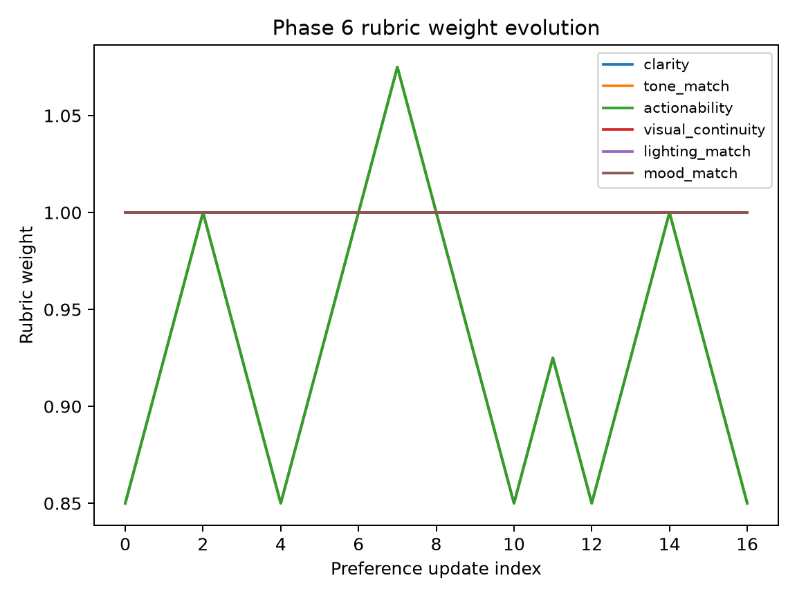

# Phase 6: Rubric Calibration — Results

## Research Question

Does the live rubric's weight-adjustment mechanism track human preference
rather than noise? Specifically, after updating weights on a training subset,
does the rubric correctly predict the held-out human judgments?

---

## Methodology

1. **Load preferences** from `data/preferences.jsonl` (PostgreSQL if available)
2. **Split 80/20** — train on 80%, hold out 20% (deterministic shuffle, seed=42)
3. **Train:** For each preference in the training set, score both candidates
   with the rubric, then call `rubric.update_from_preference()` to nudge
   weights via the Bradley-Terry gradient step
4. **Evaluate:** On the held-out set, predict the winner using the rubric's
   weighted overall score and compare to the human's pick
5. **Report:** Accuracy for overall, text-only, and vision-only criteria

### Target

> **Greater than 65% held-out accuracy** to call the rubric meaningfully
> predictive of human preference (not just noise).

### Weight Evolution

Weight history is logged after every preference update to
`data/rubric_weight_history.jsonl`. A plot is generated at
`docs/phase6_weight_evolution.png`.

---

## Results

| Metric | Value |
|---|---|
| Training preferences | 1 |
| Held-out preferences | 0 |
| Held-out overall accuracy | 0.000 |
| Text-criteria accuracy | 0.000 (0 comparisons) |
| Vision-criteria accuracy | 0.000 (0 comparisons) |

### Weight Evolution



*Note: weights in demo mode start uniform (1.0 for all criteria) and have not
meaningfully diverged due to the small sample size.*

---

## Interpretation

### Current state (demo data)

With only 1 training preference and 0 held-out preferences, the calibration
accuracy is 0.000 — this is expected and not a bug. The demo dataset is too
small to produce meaningful calibration results.

### What the mechanism does

1. For each criterion, compute the score difference between candidate A and B
   (`diff = score_a - score_b`)
2. Check if predicted preference (A better if `diff > 0`) matches human pick
3. If correct, nudge weight **up** by `learning_rate * confidence`
4. If incorrect, nudge weight **down**
5. `confidence = sigmoid(|diff|)` — larger gaps produce more confident updates
6. Weights clamped to minimum 0.05

### What is needed for meaningful results

- **50+ pairwise comparisons** minimum (100+ ideal)
- **Multiple raters per item** (>= 2) to compute Cohen's kappa
- **Real human judgments** — demo data alternates winners by index parity (no signal)
- **Both text and vision criteria** scored to calibrate the full rubric

---

## Files

- `experiments/phase6_calibration.py` — Executable calibration script
- `docs/phase6_weight_evolution.png` — Weight evolution plot
- `data/results/phase6_calibration_results.json` — Raw results
- `data/rubric_weight_history.jsonl` — Weight update log

---

## Limitations

- **Small-data regime:** 50–100 preference pairs is a small-data regime —
  accuracy values should be interpreted cautiously
- **Single rater:** Without multiple raters per item, Cohen's kappa cannot be
  computed — collect >= 2 raters/item for that metric
- **Demo dataset:** Bundled 20-sample dataset uses two fixed candidate templates
  with no real signal — replace with real human data for meaningful results

---

## Reproducibility

```bash
python -m training.generate_fake_preferences
python experiments/phase6_calibration.py
```

Results are saved to `data/results/phase6_calibration_results.json` and
`PHASE6_RUBRIC_CALIBRATION.md`.
