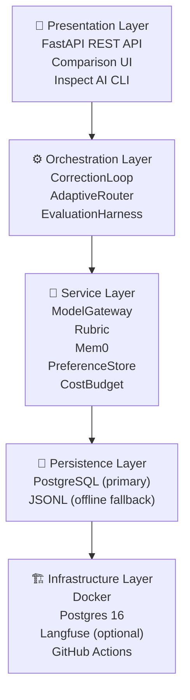

# Creative Harness

[](https://github.com/Hasan26ozcan/Script-Supervisor/actions/workflows/ci.yml)
[](https://github.com/Hasan26ozcan/Script-Supervisor/actions/workflows/trivy.yml)
[](https://github.com/Hasan26ozcan/Script-Supervisor/actions/workflows/codeql.yml)
[](https://sonarcloud.io/organizations/hasan26ozcan/projects)
[](LICENSE)
[](https://www.python.org/downloads/)

**A production-grade evaluation harness for creative shot-list generation.**

Creative Harness is a research-driven system that explores a core question in
AI-assisted creative production:

> **Can a structured correction loop, calibrated rubric, and vision-aware
> critique outperform a single-pass generation strategy while remaining
> cost-effective and auditable?**

The harness answers this with measurable evidence — bootstrap confidence
intervals, binomial significance tests, Bradley-Terry fits, and Cohen's κ —
not anecdotes. It ships as a complete, runnable system: a FastAPI backend,
prompt-driven correction loops, human preference collection, DPO dataset
export, Mem0-style compression-pair validation, PostgreSQL-backed
persistence, and structured CI/CD.

---

## Table of Contents

- [Architecture at a Glance](#architecture-at-a-glance)
- [Key Features](#key-features)
- [Quick Start](#quick-start)
- [Usage](#usage)
- [Project Structure](#project-structure)
- [Configuration](#configuration)
- [Development](#development)
- [CI / CD](#cicd)
- [Deployment](#deployment)
- [Documentation Map](#documentation-map)
- [Research Roadmap](#research-roadmap)
- [Contributing](#contributing)
- [License](#license)

---

## Architecture at a Glance

The system is organized into five architectural layers, each with a clear
responsibility boundary:



| Layer | Components |
|---|---|
| **Presentation** | FastAPI REST API, Comparison UI (HTML), Inspect AI CLI |
| **Orchestration** | CorrectionLoop, AdaptiveRouter, EvaluationHarness |
| **Service** | ModelGateway, Rubric, Mem0Manager, PreferenceStore, CostBudget |
| **Persistence** | PostgreSQL 16 (primary), JSONL (offline fallback) |
| **Infrastructure** | Docker Compose, Postgres 16, optional Langfuse, GitHub Actions CI/CD |

See [`docs/PROJECT_ARCHITECTURE.md`](docs/PROJECT_ARCHITECTURE.md) for the
full architectural write-up and [`docs/TECHNICAL_DIAGRAMS.md`](docs/TECHNICAL_DIAGRAMS.md)
for 16 detailed diagrams.

---

## Key Features

| Area | What It Does |
|---|---|
| **Correction loop** | Draft → critique → revise, with cost-aware early stopping and plateau detection |
| **Vision-grounded critique** | Optional VLM critique (grounding proven via Wilcoxon signed-rank test) |
| **Rubric scoring** | Weighted criteria with Bradley-Terry-style weight updates from human preferences |
| **Preference collection** | Pairwise comparison API (`/compare`) with persistent storage |
| **Mem0 compression pairs** | Stale detection, validation, and replacement for compression pairs |
| **DPO dataset export** | Convert recorded preferences into TRL-compatible training data |
| **DPO training** | Optional TRL `DPOTrainer` wrapper (GPU + API keys required) |
| **Adaptive routing** | YAML-driven model escalation rules with cost-aware model selection |
| **Eval harness** | Bootstrap CIs, binomial significance, Bradley-Terry fit, Cohen's κ |
| **Inspect AI adapter** | Optional integration with AISI Inspect for model-graded runs |
| **PostgreSQL persistence** | Primary backend with JSONL fallback for offline use |
| **Observability** | Optional Langfuse tracing for every gateway call |
| **Cost tracking** | Per-run and per-day budget enforcement with cost-per-quality metrics |

---

## Quick Start

### Prerequisites

- Python 3.11 or newer
- Git
- Docker (optional, for PostgreSQL and full-stack deployment)

### Installation

```bash
git clone https://github.com/Hasan26ozcan/Script-Supervisor.git
cd Script-Supervisor
python -m pip install --upgrade pip
python -m pip install -e .[dev]
```

### Run locally (mock mode)

Mock mode requires no API keys and uses synthetic model responses — ideal
for development, testing, and understanding the harness behavior:

```bash
HARNESS_MOCK_MODE=1 uvicorn app.main:app --reload
```

Open [http://127.0.0.1:8000/docs](http://127.0.0.1:8000/docs) for the
interactive API documentation.

### Run the evaluation harness

```bash
python -m training.generate_fake_preferences  # generates 20-sample demo dataset
python -m app.evaluation_harness               # runs the statistical suite
```

This generates `docs/evaluation/evaluation_report.{md,html}`,
`docs/evaluation/metrics.json`, and charts from the demo dataset. See
[`docs/evaluation/HARNESS_NOTES.md`](docs/evaluation/HARNESS_NOTES.md) for
methodology and limitations.

### Run with a real model

```bash
export HARNESS_MOCK_MODE=0
export HARNESS_ANTHROPIC_API_KEY="your-key-here"
uvicorn app.main:app --reload
```

---

## Usage

### Correction loop

```python
from app.agent_loop import CorrectionLoop

loop = CorrectionLoop()
trace = await loop.run("A cinematic wide of a desert at golden hour...")
print(trace.final_output)
print(f"Cost: ${trace.total_cost_usd:.4f}")
print(f"Stop reason: {trace.stop_reason}")
```

### Pairwise comparison (human preference collection)

```bash
curl -X POST http://127.0.0.1:8000/compare \
  -H "Content-Type: application/json" \
  -d '{
    "brief": "A dramatic opening shot",
    "candidate_a": "Wide angle, slow dolly in...",
    "candidate_b": "Close-up, handheld shake...",
    "winner": "a"
  }'
```

### Evaluation suite

```bash
curl -X POST http://127.0.0.1:8000/evaluation/run
```

### Inspect AI (model-graded eval)

```bash
pip install inspect-ai
uv run inspect eval evals/inspect_preference_task.py --model anthropic/claude-sonnet-4-6
inspect view
```

---

## Project Structure

```
Script-Supervisor/
├── app/                     # FastAPI application and core logic
│   ├── main.py              # API entry points (/run, /compare, /rubric, /mem0/*, /health)
│   ├── agent_loop.py        # Correction loop (draft → critique → revise)
│   ├── gateway.py           # Async model gateway (mock + live providers)
│   ├── rubric.py            # Rubric scoring + Bradley-Terry weight updates
│   ├── mem0.py              # Compression pair tracking + validation
│   ├── preference_store.py  # Preference persistence (PostgreSQL + JSONL fallback)
│   ├── db.py                # SQLAlchemy models and session management
│   ├── routing.py           # AdaptiveRouter with YAML escalation rules
│   ├── config.py            # Pydantic-settings configuration
│   ├── schemas.py           # Pydantic v2 data models
│   ├── prompts.py           # Prompt registry (versioned YAML templates)
│   ├── budget.py            # Cost budget tracking + enforcement
│   ├── evaluation_harness.py# Statistical evaluation suite
│   ├── logging_config.py    # structlog configuration
│   ├── database.py          # Database initialization
│   └── templates/           # Comparison UI HTML
├── config/
│   └── routing_rules.yaml   # External model routing rules
├── data/                    # Briefs, preferences, images, traces, artifacts
│   ├── briefs/              # Creative brief datasets
│   ├── images/              # Reference images (CC0 / licensed)
│   ├── traces/              # Correction-loop run traces (JSON)
│   ├── results/             # Experiment results
│   ├── preferences.jsonl    # Recorded human preferences
│   ├── dpo_dataset.jsonl    # Exported DPO training data
│   ├── rubric_weights.json  # Live rubric weights
│   └── rubric_weight_history.jsonl  # Weight evolution over time
├── docs/                    # Architecture, CI/CD, and evaluation guides
│   ├── PROJECT_ARCHITECTURE.md
│   ├── TECHNICAL_DIAGRAMS.md
│   ├── CI_CD_GUIDE.md
│   ├── evaluation/
│   │   ├── HARNESS_NOTES.md
│   │   ├── evaluation_report.md
│   │   ├── evaluation_report.html
│   │   ├── metrics.json
│   │   └── charts/
│   └── FINDINGS.md          # Consolidated findings from all phases
├── evals/                   # Inspect AI adapter
│   └── inspect_preference_task.py
├── experiments/             # Reproducible experiment scripts per phase
│   ├── phase2_grounding.py
│   ├── phase3_correction_effectiveness.py
│   ├── phase4_vision_effectiveness.py
│   ├── phase6_calibration.py
│   ├── phase7_routing.py
│   └── phase8_vision_routing.py
├── prompts/                 # Versioned prompt templates
│   ├── draft/v1.yaml
│   ├── critique/v1.yaml
│   ├── vision_critique/v1.yaml
│   └── revise/v1.yaml
├── scripts/                 # Utility scripts
│   ├── generate_comparison_pairs.py
│   └── run_eval_regression.py
├── training/                # DPO export, training wrapper, migration
│   ├── export_dpo_dataset.py
│   ├── dpo_train.py
│   ├── generate_fake_preferences.py
│   ├── migrate_preferences_to_db.py
│   └── README.md
├── tests/                   # Unit and integration tests (200+)
├── .github/workflows/       # CI/CD (lint, test, security, SonarCloud, CodeQL, Trivy)
├── docker-compose.yml       # Full-stack deployment (app + Postgres + Langfuse)
├── Dockerfile               # Container image
├── Makefile                 # Developer command shortcuts
├── pyproject.toml           # Project metadata and dependencies
├── ROADMAP.md               # 11-phase research roadmap
├── CONTRIBUTING.md          # Contribution guidelines
└── LICENSE
```

---

## Configuration

All settings use the `HARNESS_` prefix, managed by a single `Settings` class
in `app/config.py` using `pydantic-settings`. A `.env` file works out of the
box for local development.

### Environment Variables

| Variable | Default | Description |
|---|---|---|
| `HARNESS_MOCK_MODE` | `true` | Mock responses; set `false` for live API calls |
| `HARNESS_PROVIDER` | `anthropic` | LLM provider: `anthropic` or `groq` |
| `HARNESS_ANTHROPIC_API_KEY` | — | Required when mock mode is off (Anthropic) |
| `HARNESS_GROQ_API_KEY` | — | Required when provider is `groq` |
| `HARNESS_DATABASE_URL` | `postgresql+psycopg://...` | PostgreSQL connection string |
| `HARNESS_DATABASE_ECHO` | `false` | Enable SQLAlchemy SQL echo for debugging |
| `HARNESS_MAX_TURNS` | `3` | Max correction-loop iterations |
| `HARNESS_QUALITY_THRESHOLD` | `8.0` | Quality score to stop the loop |
| `HARNESS_PLATEAU_EPSILON` | `0.3` | Minimum score delta to continue the loop |
| `HARNESS_COST_EFFICIENCY_THRESHOLD` | `0.0` | Min quality-per-dollar to justify another turn |
| `HARNESS_RUN_BUDGET_USD` | — | Per-run cost cap (optional) |
| `HARNESS_DAILY_BUDGET_USD` | — | Daily cost cap (optional) |
| `HARNESS_LANGFUSE_ENABLED` | `false` | Enable Langfuse trace export |
| `HARNESS_LANGFUSE_HOST` | `http://localhost:3000` | Langfuse server URL |
| `HARNESS_LANGFUSE_PUBLIC_KEY` | — | Langfuse public key |
| `HARNESS_LANGFUSE_SECRET_KEY` | — | Langfuse secret key |
| `HARNESS_ROUTING_RULES_PATH` | `config/routing_rules.yaml` | Path to routing rules |
| `HARNESS_ROUTING_DEFAULT_MODELS` | `{}` | Fallback default models per task |
| `HARNESS_LOG_LEVEL` | `INFO` | Logging level |

---

## Development

### Prerequisites

- Python 3.11+
- Docker (for PostgreSQL integration tests)
- An [Anthropic API key](https://console.anthropic.com/) for live model calls

### Local setup

```bash
python -m pip install --upgrade pip
python -m pip install -e .[dev]        # includes pytest, ruff, mypy, etc.
make precommit                          # install git hooks
```

### Development commands

```bash
make run                # Start the API server in mock mode (with --reload)
make test               # Run the full test suite with coverage
make lint               # Run ruff + mypy
make audit              # Run pip-audit dependency check
make format             # Auto-format with ruff
make precommit          # Install pre-commit hooks
make coverage           # Generate coverage report
```

### Experiment scripts

Each Makefile target below runs a single phase experiment:

```bash
make phase2    # VLM grounding proof
make phase3    # Text correction-loop effectiveness
make phase4    # Vision-critique effectiveness
make phase5    # Generate comparison pairs for the UI
make phase6    # Rubric calibration
make phase7    # Cost-aware text routing (the key chart)
make phase8    # Cost-aware vision routing
make phase9    # DPO dataset export
make phase10   # DPO dry-run training
make phase11   # Migrate preferences to database
```

---

## CI / CD

The pipeline runs on every push and pull request to `main`:

| Job | What It Does |
|---|---|
| **Lint** | `ruff check`, `ruff format --check`, `mypy` |
| **Security (Bandit)** | Static security analysis of `app/` |
| **Test** | `pytest` with coverage, PostgreSQL service container, ≥70% coverage gate |
| **Eval Regression** | Runs the golden-QA regression suite, uploads artifacts |
| **Trivy** | Filesystem + container image vulnerability scanning |
| **CodeQL** | Semantic code analysis for security issues |
| **SonarCloud** | Code quality and coverage analysis |

See [`docs/CI_CD_GUIDE.md`](docs/CI_CD_GUIDE.md) for full details.

---

## Deployment

### Local development

```bash
HARNESS_MOCK_MODE=1 uvicorn app.main:app --reload
```

### Docker Compose (full stack)

```bash
docker compose up -d                              # app + PostgreSQL
docker compose --profile observability up -d      # adds Langfuse
```

The default profile includes the API and a PostgreSQL 16 container. The
optional `observability` profile adds Langfuse for trace visualization.

### Docker image

```bash
docker build -t creative-harness .
docker run -p 8000:8000 -e HARNESS_MOCK_MODE=1 creative-harness
```

### Production notes

- Set `HARNESS_MOCK_MODE=false` and provide real API keys for live operation
- The container runs as a non-root user (`appuser`, UID 1001)
- Languagefuse is recommended for trace observability when brief content is sensitive (self-hosted, MIT-licensed)

---

## Documentation Map

| Document | Purpose |
|---|---|
| [`ROADMAP.md`](ROADMAP.md) | 11-phase research roadmap with objectives, deliverables, and timeline |
| [`docs/PROJECT_ARCHITECTURE.md`](docs/PROJECT_ARCHITECTURE.md) | Deep dive into the system architecture |
| [`docs/TECHNICAL_DIAGRAMS.md`](docs/TECHNICAL_DIAGRAMS.md) | 16 Mermaid diagrams covering all architecture aspects |
| [`docs/CI_CD_GUIDE.md`](docs/CI_CD_GUIDE.md) | CI/CD pipeline and developer workflow guide |
| [`docs/evaluation/HARNESS_NOTES.md`](docs/evaluation/HARNESS_NOTES.md) | Evaluation methodology and statistical approach |
| [`docs/FINDINGS.md`](docs/FINDINGS.md) | Consolidated findings from all research phases |
| [`training/README.md`](training/README.md) | DPO training pipeline and GPU rental guide |
| [`CONTRIBUTING.md`](CONTRIBUTING.md) | How to contribute to the project |

---

## Research Roadmap

The project follows an 11-phase research roadmap, all completed:

| Phase | Focus | Status |
|---|---|---|
| 0 | Production-grade skeleton | ✅ Done |
| 1 | Real API calls + structured output (text) | ✅ Done |
| 2 | VLM grounding proof (statistically rigorous) | ✅ Done |
| 3 | Text correction-loop effectiveness | ✅ Done |
| 4 | Vision-critique effectiveness | ✅ Done |
| 5 | Comparison UI + preference collection | ✅ Done |
| 6 | Human preference collection + rubric calibration | ✅ Done |
| 7 | Cost-aware model routing (text) | ✅ Done |
| 8 | Cost-aware model routing (vision) | ✅ Done |
| 9 | DPO data preparation + pipeline | ✅ Done |
| 10 | DPO training + evaluation + packaging | ✅ Done |
| 11 | Architecture hardening (optional) | ✅ Done |

See [`ROADMAP.md`](ROADMAP.md) for the full phase details, or
[`docs/FINDINGS.md`](docs/FINDINGS.md) for consolidated findings.

---

## Contributing

We welcome contributions! Please read [`CONTRIBUTING.md`](CONTRIBUTING.md)
for guidelines on development setup, coding standards, testing requirements,
and the pull request process.

Quick checklist:

1. Fork the repository
2. Create a feature branch (`git checkout -b feature/your-feature`)
3. Install dev dependencies: `pip install -e .[dev]`
4. Install pre-commit hooks: `make precommit`
5. Make your changes and run `make lint && make test`
6. Commit with a descriptive message
7. Open a pull request

---

## License

This project is released under the [MIT License](LICENSE).
