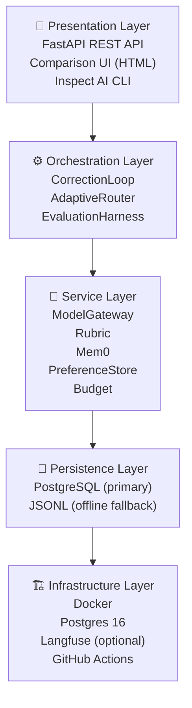
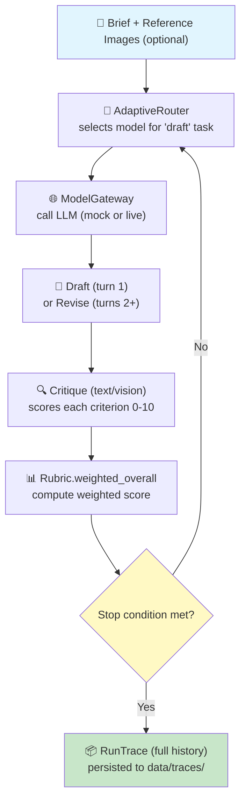
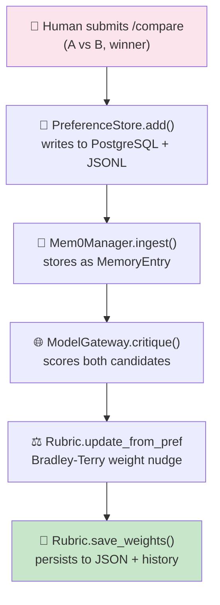
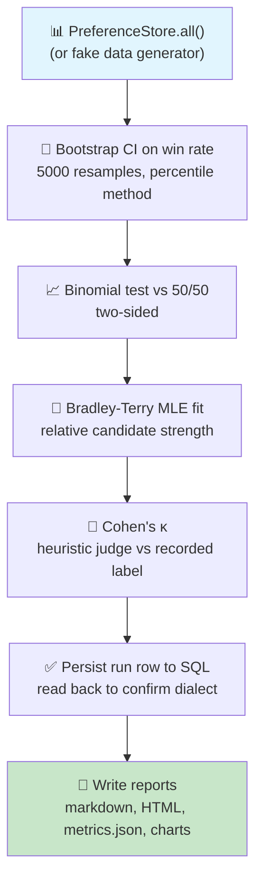
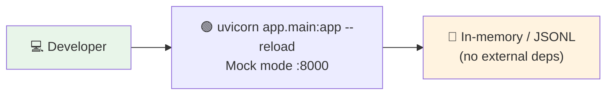
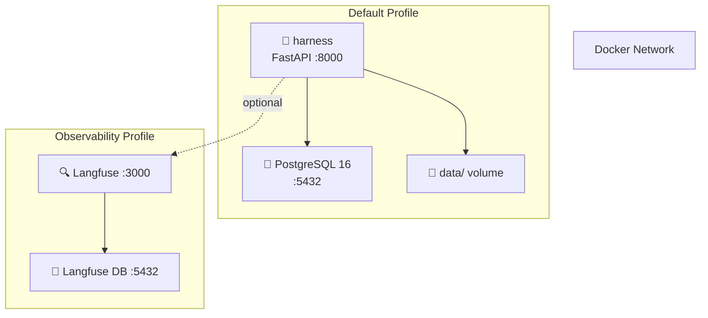
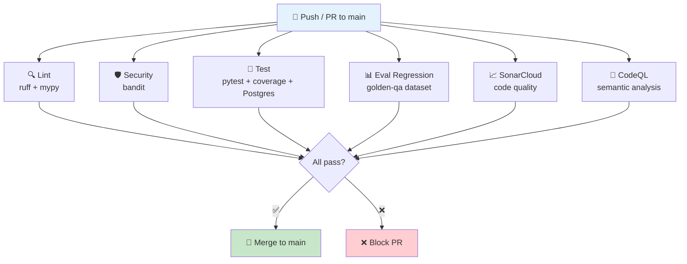

# Architecture — Creative Harness

## 1. System Overview

The Creative Harness is a production-quality evaluation and preference-collection system for creative shot-list generation. It is designed to answer a single research question with measurable evidence:

> Can a structured correction loop, calibrated rubric, and vision-aware critique outperform a simple single-pass generation strategy while remaining cost-effective and auditable?

The system is organized into five architectural layers:



---

## 2. Component Details

### 2.1 FastAPI API (`app/main.py`)

The API surface exposes seven logical groups of endpoints:

| Endpoint | Method | Purpose |
|---|---|---|
| `/run` | POST | Execute a full correction loop on a brief |
| `/traces/{run_id}` | GET | Retrieve a stored correction-loop trace |
| `/compare` | POST | Record a human pairwise preference and update rubric weights |
| `/evaluation/run` | POST | Run the statistical evaluation suite |
| `/rubric` | GET | Current rubric weights and criteria |
| `/rubric/history` | GET | Weight evolution over time |
| `/comparison-pairs` | GET | All stored comparison pairs |
| `/mem0/entries` | GET | All compression-pair entries |
| `/mem0/stale` | GET | Stale entries flagged for review |
| `/mem0/validate` | POST | Re-validate all entries against the rubric |
| `/mem0/refresh` | POST | Replace stale entries with fresh ones |
| `/compare-ui` | GET | Interactive comparison UI (HTML) |
| `/health` | GET | Liveness/readiness check |

### 2.2 Correction Loop (`app/agent_loop.py`)

The correction loop implements a **draft → critique → revise** pipeline with three honest stop conditions:

1. **Threshold met** — the weighted rubric score reaches or exceeds the configured quality threshold (default 8.0/10).
2. **Plateau** — the marginal quality gain between consecutive turns falls below the plateau epsilon (default 0.3).
3. **Cost threshold** — the quality-per-dollar ratio drops below the configured cost-efficiency threshold, indicating diminishing returns.

Each turn logs a `TraceStep` containing the draft, the critique scores, and the modality used (text or vision). The final trace includes the full step history, stop reason, total cost, and total latency.

**Key design decision**: the loop is stateless per invocation — all state lives in the returned `RunTrace`. This makes the loop trivially retryable and testable.

### 2.3 Model Gateway (`app/gateway.py`)

The gateway abstracts away the LLM provider with two modes:

- **Mock mode** (`HARNESS_MOCK_MODE=1`): returns deterministic, configurable responses. No API keys needed. Used for development, testing, and CI.
- **Live mode** (`HARNESS_MOCK_MODE=0`): routes calls to Anthropic or Groq with real API keys.

Every call is logged in a `GatewayLedger` that tracks:
- Prompt tokens, completion tokens, total cost (USD)
- Latency (ms)
- Model used
- Task type (draft, critique, revise, visual_critique)

The gateway supports **vision calls** via `call_vision()` for reference-image-grounded critique, and **text calls** via `call()` for all other tasks.

### 2.4 Adaptive Router (`app/routing.py`)

The router externalizes model-cascade policy into a YAML file (`config/routing_rules.yaml`). This means routing decisions are auditable and can evolve without code changes.

**Condition types** supported:
- `score_below` — escalate when a criterion score falls below a threshold
- `score_above` — escalate when a criterion score exceeds a threshold
- `score_between` — escalate when a score falls within a range

The router also decides whether to use the vision critique path based on whether reference images are present and the current trace state.

### 2.5 Rubric (`app/rubric.py`)

The rubric implements a **live, self-calibrating scoring system**:

- **Criteria**: `clarity`, `tone_match`, `actionability` (text) + `visual_continuity`, `lighting_match`, `mood_match` (vision)
- **Weights**: start uniform (1.0 each), updated via Bradley-Terry-style gradient steps after every human preference
- **Scoring**: LLM critic scores each criterion 0–10; weighted overall is the weighted average
- **Update rule**: when a human prefers A over B, weights are nudged toward criteria that correctly predicted the preference and away from those that got it backwards. A sigmoid-scaled confidence factor modulates the step size based on the score difference magnitude.

Weight evolution is persisted to `data/rubric_weights.json` and a full history is appended to `data/rubric_weight_history.jsonl` after every update.

### 2.6 Mem0 Compression Pairs (`app/mem0.py`)

The Mem0 module implements a **compression-pair effectiveness tracker** inspired by Mem0's memory management pattern:

- **Ingestion**: every human preference pair is stored as a `MemoryEntry` with the expected winner
- **Validation**: each entry is re-scored against the current rubric; if the rubric's predicted winner disagrees with the human's label or the margin is below the stale threshold, the entry is marked stale
- **Stale detection**: entries with low effectiveness scores (margin × 0.5) are flagged
- **Refresh**: stale entries can be replaced with fresh comparison examples that reflect current model behavior

This creates a feedback loop where the system's memory of what works gets periodically validated and refreshed, preventing stale preferences from corrupting the rubric calibration.

### 2.7 Preference Store (`app/preference_store.py`)

The preference store uses **PostgreSQL as the primary backend** with **JSONL as a transparent offline fallback**:

- On initialization, it attempts to connect to the configured database URL
- If the connection fails (missing psycopg, no Postgres running), it silently falls back to file-based JSONL
- All `add()` operations write to both the database and the JSONL fallback file simultaneously
- The `migrate_from_jsonl()` method supports one-time migration from JSONL to PostgreSQL
- SQLAlchemy ORM models (`PreferencePairModel`, `EvaluationRunModel`) define the schema

### 2.8 Evaluation Harness (`app/evaluation_harness.py`)

The harness computes five statistics with full honesty about their limitations:

1. **Bootstrap 95% CI** on human win rate (percentile method, 5000 resamples, fixed seed)
2. **Two-sided binomial test** against a 50/50 null hypothesis
3. **Bradley-Terry MLE fit** for relative candidate-template strength
4. **Agreement rate + Cohen's κ** between a heuristic offline judge and the recorded human label
5. **SQL backend confirmation** — reads back the persisted run row to verify which database dialect actually served the write

The bundled 20-sample demo dataset is explicitly documented as insufficient for statistically meaningful conclusions (see `docs/evaluation/HARNESS_NOTES.md`).

### 2.9 Inspect AI Adapter (`evals/inspect_preference_task.py`)

An optional adapter into the [Inspect AI](https://inspect.aisi.org.uk/) framework (UK AISI, MIT-licensed) for real model-graded pairwise runs:

- Ships two tasks: single-ordering eval and position-bias-checked eval (both orderings per pair)
- Requires `inspect-ai` package and a real model API key
- Complementary to the offline harness — the offline harness works without network access, while Inspect provides log viewer UI and statistical aggregation

---

## 3. Data Flow

### 3.1 Correction Loop Flow



### 3.2 Preference Collection Flow



### 3.3 Evaluation Flow



---

## 4. Deployment Architecture

### 4.1 Local Development



### 4.2 Docker Compose (Full Stack)



### 4.3 CI/CD Pipeline



---

## 5. Configuration Architecture

All configuration is centralized in `app/config.py` using `pydantic-settings` with the `HARNESS_` environment prefix:

```mermaid
graph TD
    ENV["🌍 Environment Variables<br/>HARNESS_ prefix"] --> MOCK["mock_mode<br/>boolean, default True"]
    ENV --> API_KEYS["API Keys<br/>anthropic_api_key<br/>groq_api_key"]
    ENV --> PROVIDER["provider<br/>'anthropic' | 'groq'"]
    ENV --> LOOP["Loop Settings<br/>max_turns, threshold,<br/>plateau_epsilon"]
    ENV --> DB["Database<br/>database_url<br/>database_echo"]
    ENV --> ROUTING["Routing<br/>routing_rules_path<br/>routing_default_models"]
    ENV --> RUBRIC["Rubric<br/>rubric_weights_path<br/>rubric_weight_history_path"]
    ENV --> BUDGET["Budget<br/>run_budget_usd<br/>daily_budget_usd"]
    ENV --> OBS["Observability<br/>langfuse_enabled<br/>langfuse_public_key<br/>langfuse_secret_key"]
    ENV --> LOG["Logging<br/>log_level"]
    
    ENV --> DOTENV["📄 .env file<br/>(auto-loaded for local dev)"]
    ENV --> CI_SECRETS["🔐 GitHub Actions Secrets<br/>(for CI/CD)"]
    
    style ENV fill:#e1f5fe
    style DOTENV fill:#fff9c4
    style CI_SECRETS fill:#fce4ec
```



---

## 6. Key Design Decisions

### 6.1 Mock-first architecture
The gateway defaults to mock mode so the entire system is runnable and testable without API keys or GPU resources. Real model calls are opt-in via `HARNESS_MOCK_MODE=0`.

### 6.2 PostgreSQL with JSONL fallback
PostgreSQL is the primary backend for production use, but the system degrades gracefully to JSONL files when the database is unavailable. This ensures the evaluation pipeline works in offline/CI environments without configuration changes.

### 6.3 YAML-based routing rules
Model escalation policy is externalized to YAML so it can be audited, versioned, and changed without code modifications. The `AdaptiveRouter` reads rules at startup and evaluates them per-task per-turn.

### 6.4 Bradley-Terry weight updates
Rather than using fixed rubric weights, the system learns from human preferences using a per-criterion Bradley-Terry gradient step. This is intentionally simple (not a full joint logistic regression) — it demonstrates the mechanism works and can be upgraded once sufficient preference data exists.

### 6.5 Honest statistics
The evaluation harness explicitly reports the limitations of its demo dataset and does not fabricate statistical significance. The bootstrap CI, binomial test, and Bradley-Terry fit are all implemented with real statistical methods (numpy/scipy), and the Cohen's κ calculation honestly returns "not computable" when there is only one rater per item.

### 6.6 Cost-awareness
Every LLM call is tracked for tokens and cost. The correction loop can stop early when the quality-per-dollar ratio drops below a threshold, preventing wasteful over-generation. Optional per-run and per-day budget caps provide hard limits.

---

## 7. Extension Points

```mermaid
mindmap
  root((Extension Points))
    New LLM Provider
      app/gateway.py
      Add model prices
      Provider-specific call logic
    New Rubric Criterion
      app/rubric.py
      Add to DEFAULT_CRITERIA
      Add to VISUAL_CRITERIA
    New Routing Rule
      config/routing_rules.yaml
      Add RoutingRule entry
    New Experiment Phase
      experiments/
      Add phaseN_short_name.py
      Add make phaseN target
    New API Endpoint
      app/main.py
      Pydantic request/response models
    New Persistence Backend
      app/preference_store.py
      Implement PreferenceStore interface
    New Eval Metric
      app/evaluation_harness.py
      Add function to run_evaluation_suite()
```
