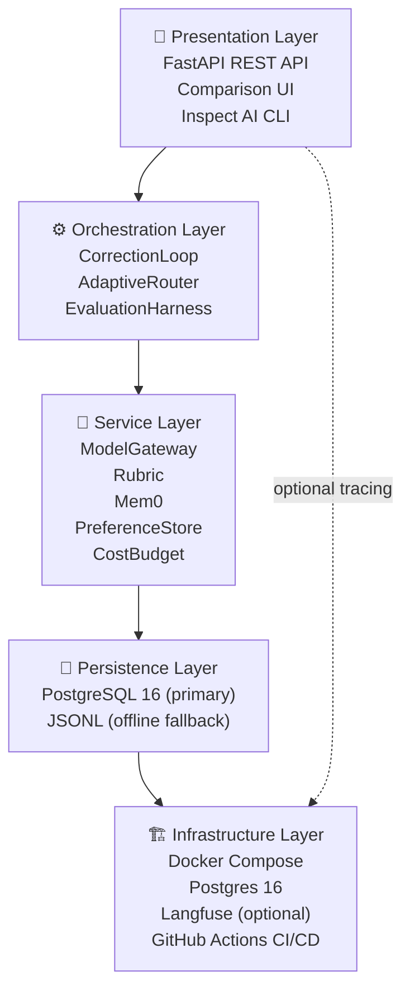
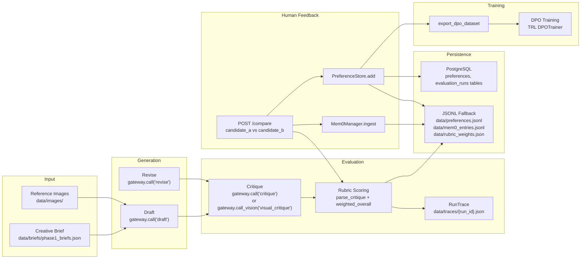
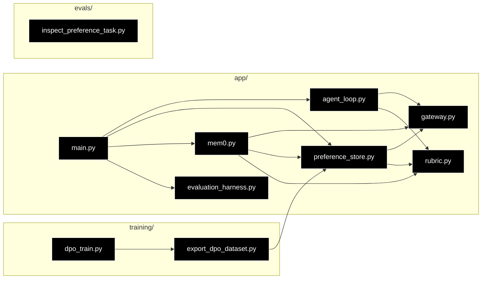
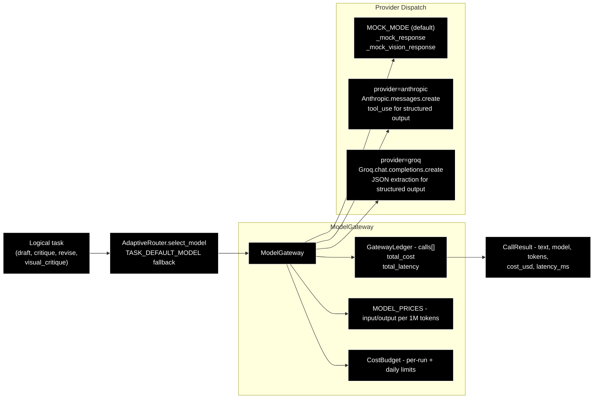

# Project Architecture

## Overview

Creative Harness is a production-quality AI evaluation and preference-collection
system for shot-list generation. The system evaluates whether structured
correction loops, calibrated rubrics, and vision-aware critique can outperform
single-pass generation — measured with real statistics, not anecdotes.

The architecture follows a clean five-layer design, with the core FastAPI
application at the center and all external concerns (persistence, model
providers, observability) behind abstractions that keep the system testable
in isolation.



### Layer Responsibilities

| Layer | Components | Responsibility |
|---|---|---|
| **Presentation** | FastAPI REST API, Comparison UI, Inspect AI CLI | User-facing API endpoints, HTML comparison interface, model-graded eval adapter |
| **Orchestration** | CorrectionLoop, AdaptiveRouter, EvaluationHarness | Control flow for correction iterations, model escalation decisions, statistical evaluation |
| **Service** | ModelGateway, Rubric, Mem0Manager, PreferenceStore, CostBudget | Provider abstraction, scoring/weight updates, compression pair tracking, preference persistence, cost enforcement |
| **Persistence** | PostgreSQL 16, JSONL files | Durable storage for preferences, rubric weights, run traces, and Mem0 entries |
| **Infrastructure** | Docker Compose, Postgres 16, Langfuse, GitHub Actions | Container orchestration, database, observability, and CI/CD |

---

## Directory Layout

```
Script-Supervisor/
├── app/                        # Core FastAPI application and backend logic
│   ├── main.py                 # API entrypoints (/run, /compare, /rubric, /mem0/*)
│   ├── agent_loop.py           # Correction loop: draft → critique → revise
│   ├── gateway.py              # Async model gateway (mock + live providers)
│   ├── rubric.py               # Rubric scoring + Bradley-Terry weight updates
│   ├── mem0.py                 # Compression pair tracking + validation
│   ├── preference_store.py     # Preference persistence (PostgreSQL + JSONL)
│   ├── db.py                   # SQLAlchemy models and session management
│   ├── routing.py              # AdaptiveRouter with YAML escalation rules
│   ├── config.py               # Pydantic-settings configuration
│   ├── schemas.py              # Pydantic v2 data models
│   ├── prompts.py              # Prompt registry (versioned YAML templates)
│   ├── budget.py               # Cost budget tracking + enforcement
│   ├── evaluation_harness.py   # Statistical evaluation suite
│   ├── logging_config.py       # structlog configuration
│   └── templates/              # Comparison UI HTML
├── config/
│   └── routing_rules.yaml      # External model routing rules
├── data/                       # Briefs, preferences, images, traces, artifacts
├── docs/                       # Architecture, CI/CD, and evaluation guides
├── evals/                      # Inspect AI adapter
├── experiments/                # Reproducible experiment scripts per phase
├── training/                   # DPO export, training wrapper, migration
├── tests/                      # Unit and integration tests (200+)
├── prompts/                    # Versioned prompt templates
├── scripts/                    # Utility scripts
├── .github/workflows/          # CI/CD pipelines
├── docker-compose.yml          # Full-stack deployment
└── Dockerfile                  # Container image
```

---

## Core Components

### FastAPI Application (`app/main.py`)

The API layer exposes endpoints for the correction loop, preference collection,
rubric management, Mem0 operations, and evaluation:

| Endpoint | Method | Description |
|---|---|---|
| `/run` | POST | Execute the correction loop on a brief, return full trace |
| `/traces/{run_id}` | GET | Retrieve a stored trace JSON |
| `/compare` | POST | Record a human pairwise preference, update rubric weights |
| `/evaluation/run` | POST | Run the statistical evaluation suite |
| `/rubric` | GET | Current rubric criteria and weights |
| `/rubric/history` | GET | Weight evolution over time |
| `/comparison-pairs` | GET | All comparison pairs |
| `/mem0/entries` | GET | All Mem0 compression entries |
| `/mem0/stale` | GET | Stale compression entries |
| `/mem0/validate` | POST | Re-validate all Mem0 entries |
| `/mem0/refresh` | POST | Replace stale Mem0 entries |
| `/compare-ui` | GET | Interactive HTML comparison UI |
| `/health` | GET | Liveness probe |

### Correction Loop (`app/agent_loop.py`)

The `CorrectionLoop` class implements the core feedback mechanism:
draft → critique → revise, with an honest stop condition.

**Key design decisions:**
- Drafts are generated with a cheap model by default; escalation happens via
  `AdaptiveRouter` when critique scores fall below thresholds
- Critiques can use either text-only or vision-grounded VLM critique
- The loop stops under four conditions: quality threshold met, plateau
  (score delta < epsilon), cost threshold exceeded, or max turns reached
- Cost-aware early stopping: the marginal quality gain per dollar is tracked
  and the loop stops when the last turn wasn't cost-efficient enough

The `RunTrace` model captures the full execution trace — every draft, every
critique, model provenance, token counts, costs, and latency — making every
decision auditable after the fact.

### Model Gateway (`app/gateway.py`)

The `ModelGateway` abstracts model providers behind a single interface:

```python
gateway = ModelGateway(ledger)
result = await gateway.call("draft", system_prompt, user_prompt)
# or for vision:
result = await gateway.call_vision("visual_critique", system, prompt, image_paths)
```

**Features:**
- **Mock mode** (default): synthetic responses — no API keys, no cost
- **Live mode**: Anthropic or Groq providers
- **Cost tracking**: `GatewayLedger` records every call's tokens, cost, and latency
- **Structured output**: `call_structured()` uses Anthropic tool use with Pydantic schemas for reliable parsing
- **Budget awareness**: `CostBudget` can raise `BudgetExceeded` before calls that would exceed configured limits
- **Model provenance**: every `CallResult` records which model was used

### Rubric (`app/rubric.py`)

The live rubric scores critic responses against configurable criteria:

```
Text criteria:   clarity, tone_match, actionability
Vision criteria: visual_continuity, lighting_match, mood_match
```

**Weight update mechanism:** Each time a human submits a preference (A beats
B), the rubric computes per-criterion score differences and nudges weights
toward criteria that correctly predicted the human's choice — a simplified
per-criterion Bradley-Terry gradient step. Weights are persisted to
`data/rubric_weights.json` and every update is appended to
`data/rubric_weight_history.jsonl` for traceability.

### Mem0 Manager (`app/mem0.py`)

Named after the open-source Mem0 project, this component tracks compression
pairs — candidate comparisons that are re-validated over time. Each entry has
a lifecycle: `active` → (validate) → `active` or `stale` → (refresh) → `replaced`.

Stale entries (where the rubric's predicted winner no longer matches the
expected winner, or the margin is too small) are flagged for replacement,
ensuring the comparison pool stays meaningful as models evolve.

### Adaptive Router (`app/routing.py`)

Routing rules are externalized to `config/routing_rules.yaml`, making the
cost-aware escalation policy auditable and evolvable without code changes.

```yaml
- task: draft
  condition:
    type: score_below
    metric: overall
    threshold: 7.5
  escalate_to: claude-sonnet-5
  max_escalations: 1
```

The router supports post-response cascading: a cheaper model generates first,
and the critique score determines whether to escalate for the next turn.

### Preference Store (`app/preference_store.py`)

PostgreSQL is the primary backend; JSONL is the offline fallback when the
database is unreachable. The store writes to both, so data is never lost
even if the database is temporarily down.

### Evaluation Harness (`app/evaluation_harness.py`)

Two complementary evaluation layers:

1. **Offline harness** (`app/evaluation_harness.py`): Fully offline — no API
   keys or network required. Computes:
   - Bootstrap 95% confidence interval on human win rate
   - Two-sided binomial test vs 50/50 null
   - Bradley-Terry MLE fit of candidate strength
   - Agreement + Cohen's κ between heuristic judge and human

2. **Inspect AI adapter** (`evals/inspect_preference_task.py`): Real model-graded
   pairwise preference evaluation via the UK AISI Inspect framework, with
   position-bias-checked scoring (each pair run in both orderings).

---

## Data Flow — End-to-End Pipeline



---

## Module Dependency Graph



### Internal Dependency Table

| Module | Imports from |
|---|---|
| `app/main.py` | `agent_loop`, `gateway`, `rubric`, `preference_store`, `mem0`, `evaluation_harness`, `config`, `prompts`, `schemas` |
| `app/agent_loop.py` | `gateway`, `rubric`, `routing`, `prompts`, `schemas`, `config` |
| `app/gateway.py` | `config`, `schemas`, `logging_config`, `budget` |
| `app/rubric.py` | `config`, `schemas` |
| `app/mem0.py` | `gateway`, `rubric`, `prompts`, `schemas`, `config` |
| `app/preference_store.py` | `db`, `schemas`, `config` |
| `app/evaluation_harness.py` | `preference_store`, `schemas`, `config` |
| `training/export_dpo_dataset.py` | `preference_store` |
| `training/dpo_train.py` | `export_dpo_dataset`, `preference_store` |
| `evals/inspect_preference_task.py` | `schemas` |

> **Note:** The `settings` object (`app/config.py`) and schema types
> (`app/schemas.py`) are shared across nearly all modules but omitted from the
> dependency diagram for clarity.

---

## Database Schema

PostgreSQL is the primary persistence backend, with JSONL as an offline
fallback. The schema covers preferences, evaluation runs, comparison pairs,
rubric weight history, and Mem0 compression entries.

See [`docs/TECHNICAL_DIAGRAMS.md`](TECHNICAL_DIAGRAMS.md#6-database-schema--entity-relationship)
for the full entity-relationship diagram.

### Core Tables

| Table | Purpose |
|---|---|
| `preferences` | Human pairwise judgments (the atomic unit of preference data) |
| `evaluation_runs` | Metadata for each evaluation run (dataset, accuracy, report paths) |
| `comparison_pairs` | Pairs shown to raters in the comparison UI |
| `rubric_weights` | Current rubric criterion weights |
| `rubric_weight_history` | Snapshot of weights after each preference update |
| `mem0_entries` | Compression pair tracking with staleness status |

---

## Provider Integration



The gateway supports two providers:

- **Anthropic** (default): Claude 3.5 Sonnet, Claude 4 Haiku — uses native
  tool use for structured critique output
- **Groq**: Llama 3.1 8B/70B, Llama 3.2 Vision — uses JSON extraction for
  structured output

Mock mode returns deterministic synthetic responses, making the entire system
testable without API keys or spend.

---

## Configuration Binding

All settings use the `HARNESS_` environment prefix, managed by a single
`Settings` class in `app/config.py` using `pydantic-settings`. A `.env` file
works out of the box for local development.

| Variable | Default | Type | Description |
|---|---|---|---|
| `HARNESS_MOCK_MODE` | `true` | bool | Mock responses; `false` for live API calls |
| `HARNESS_PROVIDER` | `anthropic` | str | LLM provider: `anthropic` or `groq` |
| `HARNESS_ANTHROPIC_API_KEY` | None | str | Required when mock mode is off |
| `HARNESS_GROQ_API_KEY` | None | str | Required when provider is `groq` |
| `HARNESS_MAX_TURNS` | `3` | int | Max correction-loop iterations |
| `HARNESS_QUALITY_THRESHOLD` | `8.0` | float | Quality score to stop the loop |
| `HARNESS_PLATEAU_EPSILON` | `0.3` | float | Score delta below which to stop |
| `HARNESS_COST_EFFICIENCY_THRESHOLD` | `0.0` | float | Min quality-per-dollar to continue |
| `HARNESS_DATABASE_URL` | PostgreSQL URL | str | Primary SQL database |
| `HARNESS_DATABASE_ECHO` | `false` | bool | SQL echo for debugging |
| `HARNESS_PREFERENCES_PATH` | `data/preferences.jsonl` | str | JSONL fallback path |
| `HARNESS_MEM0_STATE_PATH` | `data/mem0_entries.jsonl` | str | Mem0 entries JSONL |
| `HARNESS_DATA_DIR` | `data` | str | Base data directory |
| `HARNESS_TRACES_DIR` | `data/traces` | str | Run traces output |
| `HARNESS_RUBRIC_WEIGHTS_PATH` | `data/rubric_weights.json` | str | Live rubric weights |
| `HARNESS_RUBRIC_WEIGHT_HISTORY_PATH` | `data/rubric_weight_history.jsonl` | str | Weight evolution log |
| `HARNESS_COMPARISON_PAIRS_PATH` | `data/comparisons/phase5_pairs.jsonl` | str | Comparison pairs |
| `HARNESS_EVALUATION_REPORTS_DIR` | `docs/evaluation` | str | Eval output directory |
| `HARNESS_RUN_BUDGET_USD` | None | float | Per-run cost cap |
| `HARNESS_DAILY_BUDGET_USD` | None | float | Daily cost cap |
| `HARNESS_ROUTING_RULES_PATH` | `config/routing_rules.yaml` | str | Routing rules file |
| `HARNESS_ROUTING_DEFAULT_MODES` | `{}` | dict | Fallback models per task |
| `HARNESS_MEM0_STALE_MARGIN` | `1.0` | float | Stale detection threshold |
| `HARNESS_LANGFUSE_ENABLED` | `false` | bool | Enable Langfuse tracing |
| `HARNESS_LANGFUSE_HOST` | `http://localhost:3000` | str | Langfuse server URL |
| `HARNESS_LOG_LEVEL` | `INFO` | str | Logging level |

---

## Deployment

### Local development

```bash
HARNESS_MOCK_MODE=1 uvicorn app.main:app --reload
```

### Docker Compose (full stack)

```bash
docker compose up -d                              # app + PostgreSQL
docker compose --profile observability up -d      # adds Langfuse
```

The default profile includes the API app and a PostgreSQL 16 container. The
optional `observability` profile adds Langfuse for trace visualization with
its own PostgreSQL instance.

### Docker image

```bash
docker build -t creative-harness .
docker run -p 8000:8000 -e HARNESS_MOCK_MODE=1 creative-harness
```

The container runs as a non-root user (`appuser`, UID 1001), with all pip
vendored packages removed from the final image to minimize CVE surface.
