# Technical Architecture Diagrams — Creative Harness

This document provides a comprehensive set of technical diagrams for the Creative Harness evaluation system. All diagrams use plain-text identifiers and structural annotations rather than decorative symbols, suitable for inclusion in technical documentation.

---

## 1. Five-Layer Architecture

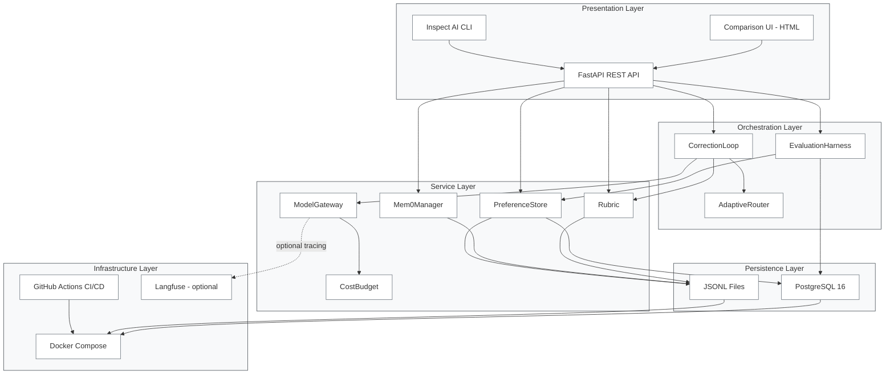

---

## 2. Module Dependency Graph

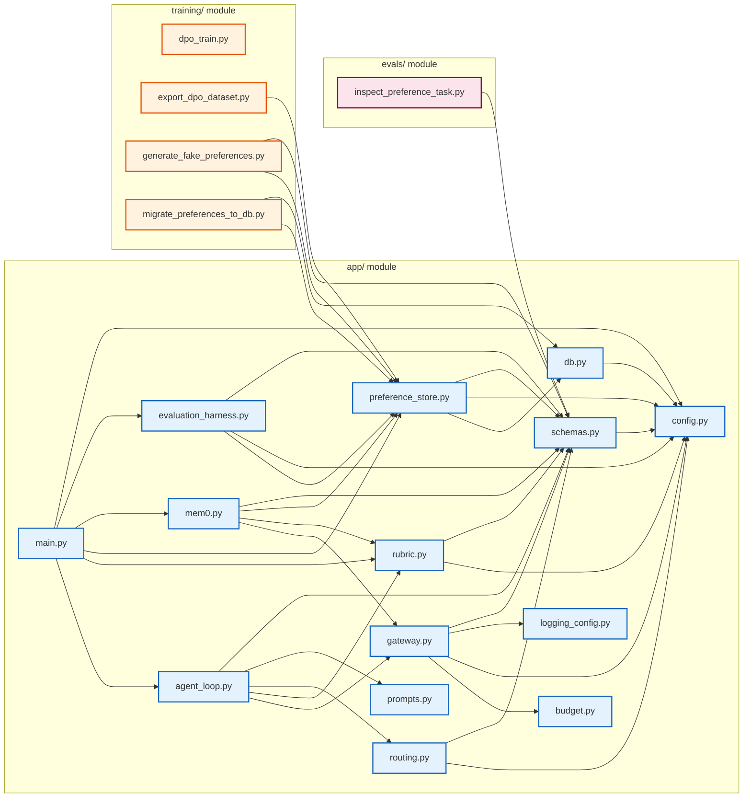

---

## 3. Correction Loop — Detailed Sequence

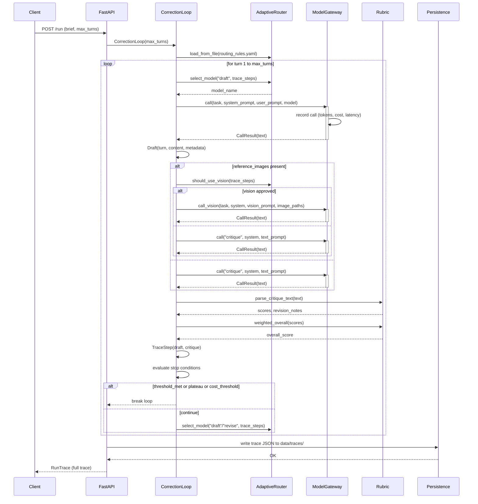

---

## 4. Rubric Weight Update — Bradley-Terry Gradient

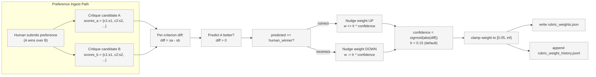

---

## 5. Data Flow — End-to-End Pipeline

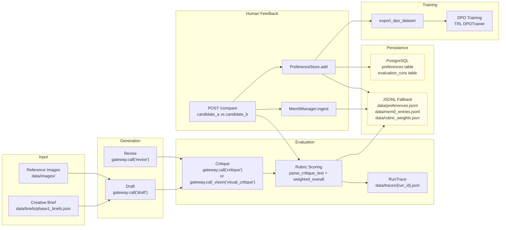

---

## 6. Database Schema — Entity Relationship

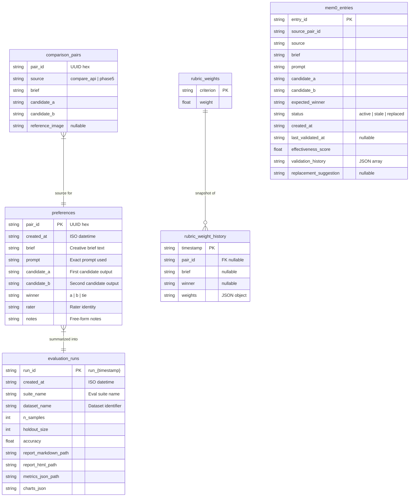

---

## 7. API Endpoint Map

```mermaid
graph TD
    POST_RUN["POST /run<br/>Execute correction loop"]
    GET_TRACE["GET /traces/{run_id}<br/>Retrieve trace JSON"]
    POST_COMPARE["POST /compare<br/>Record pairwise preference"]
    POST_EVAL["POST /evaluation/run<br/>Run statistical suite"]
    GET_RUBRIC["GET /rubric<br/>Current criteria + weights"]
    GET_RUBRIC_HISTORY["GET /rubric/history<br/>Weight evolution"]
    GET_COMPARISONS["GET /comparison-pairs<br/>All comparison pairs"]
    GET_MEM0_ENTRIES["GET /mem0/entries<br/>All compression entries"]
    GET_MEM0_STALE["GET /mem0/stale<br/>Stale entries"]
    POST_MEM0_VALIDATE["POST /mem0/validate<br/>Re-validate all entries"]
    POST_MEM0_REFRESH["POST /mem0/refresh<br/>Replace stale entries"]
    GET_COMPARE_UI["GET /compare-ui<br/>Interactive HTML UI"]
    GET_HEALTH["GET /health<br/>Liveness probe"]

    subgraph "Correction Loop"<br/>POST_RUN
        POST_RUN
        GET_TRACE
    end

    subgraph "Preference Management"
        POST_COMPARE
        GET_RUBRIC
        GET_RUBRIC_HISTORY
    end

    subgraph "Mem0 Compression Tracking"
        GET_MEM0_ENTRIES
        GET_MEM0_STALE
        POST_MEM0_VALIDATE
        POST_MEM0_REFRESH
    end

    subgraph "Evaluation"
        POST_EVAL
    end

    subgraph "Operational"
        GET_COMPARE_UI
        GET_HEALTH
        GET_COMPARISONS
    end

    POST_COMPARE --> GET_RUBRIC
    POST_COMPARE --> GET_MEM0_ENTRIES
    POST_EVAL --> GET_RUBRIC_HISTORY

    classDef group fill:#f5f5f5,stroke:#9e9e9e,stroke-width:1px;
    class POST_RUN,GET_TRACE,POST_COMPARE,GET_RUBRIC,GET_RUBRIC_HISTORY,GET_COMPARISONS,GET_MEM0_ENTRIES,GET_MEM0_STALE,POST_MEM0_VALIDATE,POST_MEM0_REFRESH,GET_COMPARE_UI,GET_HEALTH,POST_EVAL group;
```

---

## 8. Provider Integration — Gateway Abstraction

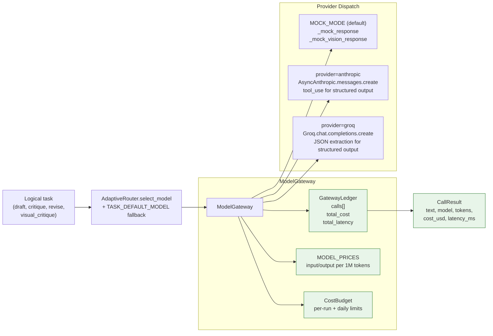

---

## 9. Evaluation Harness — Statistical Pipeline

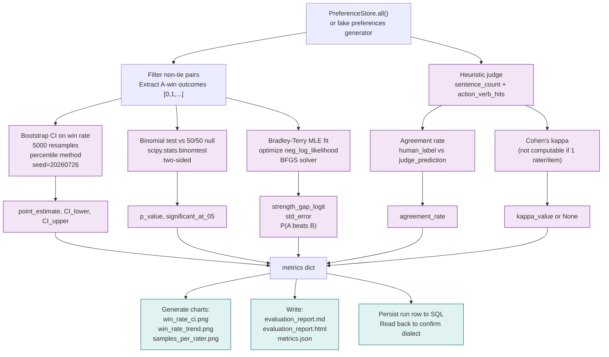

---

## 10. CI/CD Pipeline — Job Dependencies

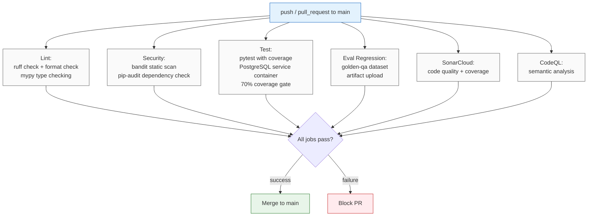

---

## 11. Configuration Binding — Environment to Components

```mermaid
graph TD
    ENV["Environment Variables<br/>HARNESS_ prefix + .env file"]

    subgraph "Correction Loop"
        MAX_TURNS["max_turns: int = 3"]
        THRESHOLD["quality_threshold: float = 8.0"]
        PLATEAU["plateau_epsilon: float = 0.3"]
        COST_THRESH["cost_efficiency_threshold: float = 0.0"]
    end

    subgraph "Gateway / Provider"
        MOCK["mock_mode: bool = True"]
        PROVIDER["provider: str = 'anthropic'"]
        ANTHROPIC_KEY["anthropic_api_key: Optional[str]"]
        GROQ_KEY["groq_api_key: Optional[str]"]
    end

    subgraph "Persistence"
        DB_URL["database_url: str"]
        DB_ECHO["database_echo: bool = False"]
        PREF_PATH["preferences_path: str"]
        MEM0_PATH["mem0_state_path: str"]
    end

    subgraph "Storage Paths"
        DATA_DIR["data_dir: str = 'data'"]
        TRACES_DIR["traces_dir: str = 'data/traces'"]
        RUBRIC_PATH["rubric_weights_path: str"]
        RUBRIC_HIST["rubric_weight_history_path: str"]
        COMPARE_PATH["comparison_pairs_path: str"]
        EVAL_DIR["evaluation_reports_dir: str"]
    end

    subgraph "Budgeting"
        RUN_BUDGET["run_budget_usd: Optional[float]"]
        DAILY_BUDGET["daily_budget_usd: Optional[float]"]
    end

    subgraph "Routing"
        ROUTE_PATH["routing_rules_path: str"]
        ROUTE_DEFAULTS["routing_default_models: dict"]
    end

    subgraph "Mem0"
        STALE_MARGIN["mem0_stale_margin: float = 1.0"]
    end

    subgraph "Observability"
        LANGFUSE_EN["langfuse_enabled: bool = False"]
        LANGFUSE_PUB["langfuse_public_key: Optional[str]"]
        LANGFUSE_SEC["langfuse_secret_key: Optional[str]"]
        LANGFUSE_HOST["langfuse_host: str"]
    end

    subgraph "Logging"
        LOG_LEVEL["log_level: str = 'INFO'"]
    end

    ENV --> MAX_TURNS
    ENV --> THRESHOLD
    ENV --> PLATEAU
    ENV --> COST_THRESH
    ENV --> MOCK
    ENV --> PROVIDER
    ENV --> ANTHROPIC_KEY
    ENV --> GROQ_KEY
    ENV --> DB_URL
    ENV --> DB_ECHO
    ENV --> PREF_PATH
    ENV --> MEM0_PATH
    ENV --> DATA_DIR
    ENV --> TRACES_DIR
    ENV --> RUBRIC_PATH
    ENV --> RUBRIC_HIST
    ENV --> COMPARE_PATH
    ENV --> EVAL_DIR
    ENV --> RUN_BUDGET
    ENV --> DAILY_BUDGET
    ENV --> ROUTE_PATH
    ENV --> ROUTE_DEFAULTS
    ENV --> STALE_MARGIN
    ENV --> LANGFUSE_EN
    ENV --> LANGFUSE_PUB
    ENV --> LANGFUSE_SEC
    ENV --> LANGFUSE_HOST
    ENV --> LOG_LEVEL

    classDef env fill:#e1f5fe,stroke:#0277bd,stroke-width:2px;
    classDef group fill:#fafafa,stroke:#424242,stroke-width:1px;
    class ENV env;
    class MAX_TURNS,THRESHOLD,PLATEAU,COST_THRESH,MOCK,PROVIDER,ANTHROPIC_KEY,GROQ_KEY,DB_URL,DB_ECHO,PREF_PATH,MEM0_PATH,DATA_DIR,TRACES_DIR,RUBRIC_PATH,RUBRIC_HIST,COMPARE_PATH,EVAL_DIR,RUN_BUDGET,DAILY_BUDGET,ROUTE_PATH,ROUTE_DEFAULTS,STALE_MARGIN,LANGFUSE_EN,LANGFUSE_PUB,LANGFUSE_SEC,LANGFUSE_HOST,LOG_LEVEL group;
```

---

## 12. Docker Compose — Service Topology

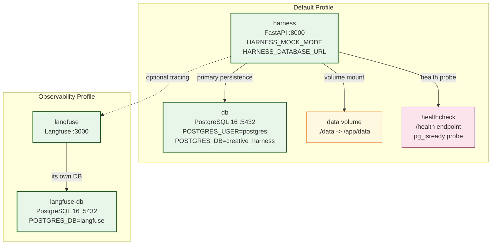

---

## 13. State Machine — Correction Loop Termination

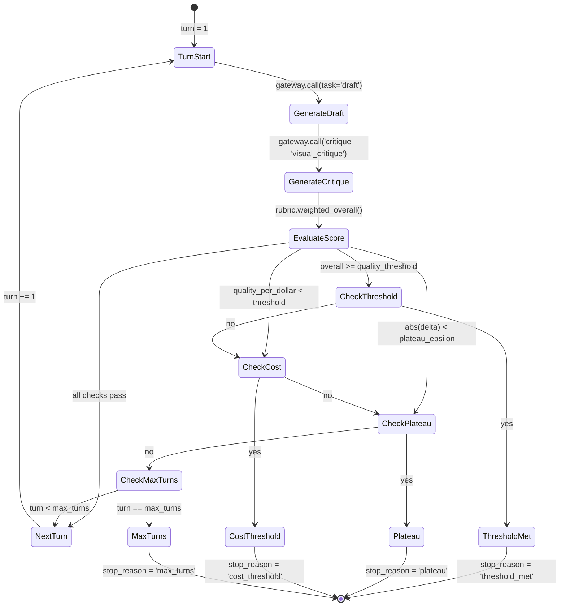

---

## 14. Mem0 Compression Pair Lifecycle

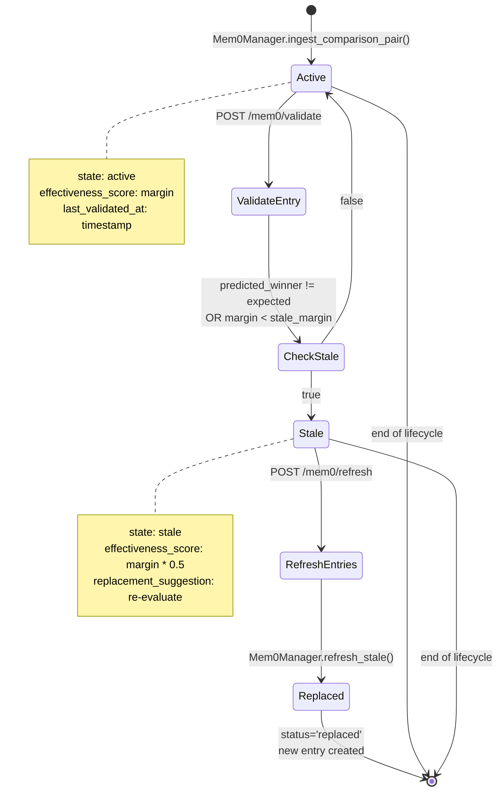

---

## 15. Prompt Registry — Template Loading

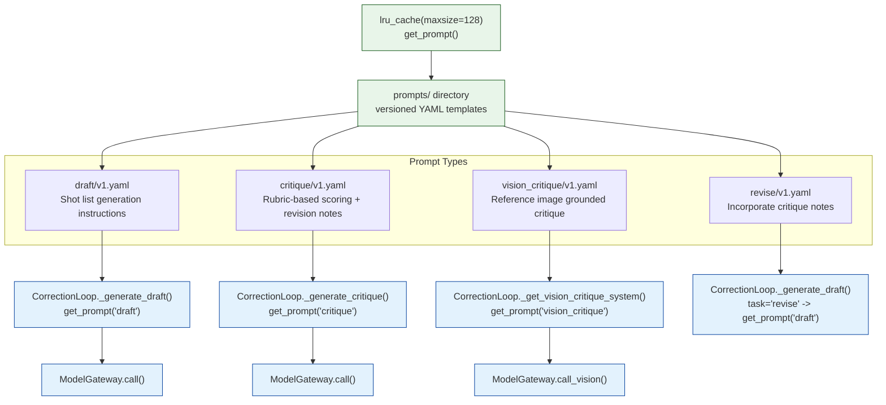

---

## 16. Test Suite — Coverage Areas

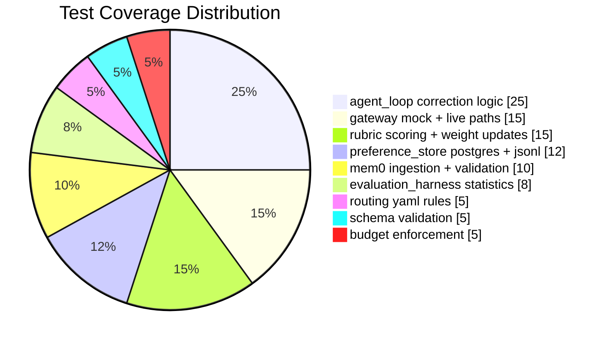

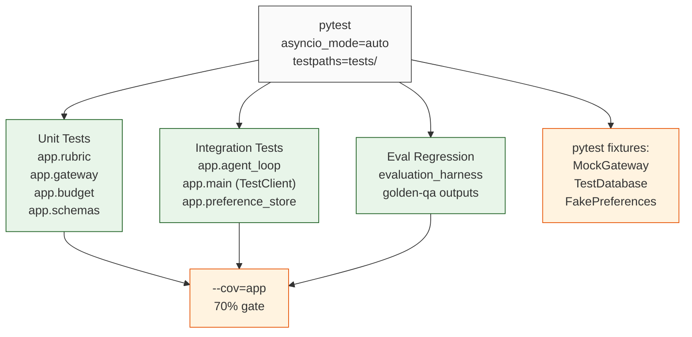
