# Technical Architecture Diagrams

This document provides a comprehensive set of technical diagrams for the
Creative Harness evaluation system. All diagrams use plain-text identifiers and
structural annotations suitable for inclusion in technical documentation.

> **Rendering note:** All diagrams use Mermaid syntax. GitHub renders these
> natively in markdown. For local rendering, install the
> [Markdown Preview Mermaid Support](https://marketplace.visualstudio.com/items?itemName=vstirbu.comments-preview-vscode)
> VS Code extension, or use `mmdc` to export to PNG/SVG.

---

## 1. Five-Layer Architecture — High Level

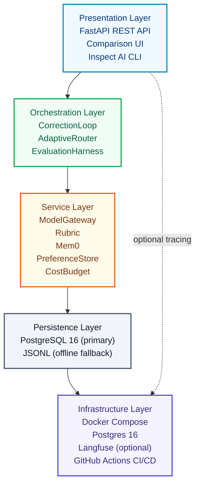

The system is organized into five architectural layers, each with a clear
responsibility boundary:

| Layer | Components | Responsibility |
|---|---|---|
| **Presentation** | FastAPI REST API, Comparison UI (HTML), Inspect AI CLI | Expose endpoints, serve HTML UI, integrate with Inspect AI |
| **Orchestration** | CorrectionLoop, AdaptiveRouter, EvaluationHarness | Control flow for correction iterations, model escalation, statistical eval |
| **Service** | ModelGateway, Rubric, Mem0Manager, PreferenceStore, CostBudget | Provider abstraction, scoring, compression tracking, persistence, cost |
| **Persistence** | PostgreSQL 16 (primary), JSONL (offline fallback) | Durable storage for preferences, traces, rubric state, Mem0 entries |
| **Infrastructure** | Docker Compose, Postgres 16, optional Langfuse, GitHub Actions CI/CD | Container orchestration, database, observability, CI/CD |

---

## 2. Module Dependency Graph

Key internal package dependencies (selective view — see source for full detail):

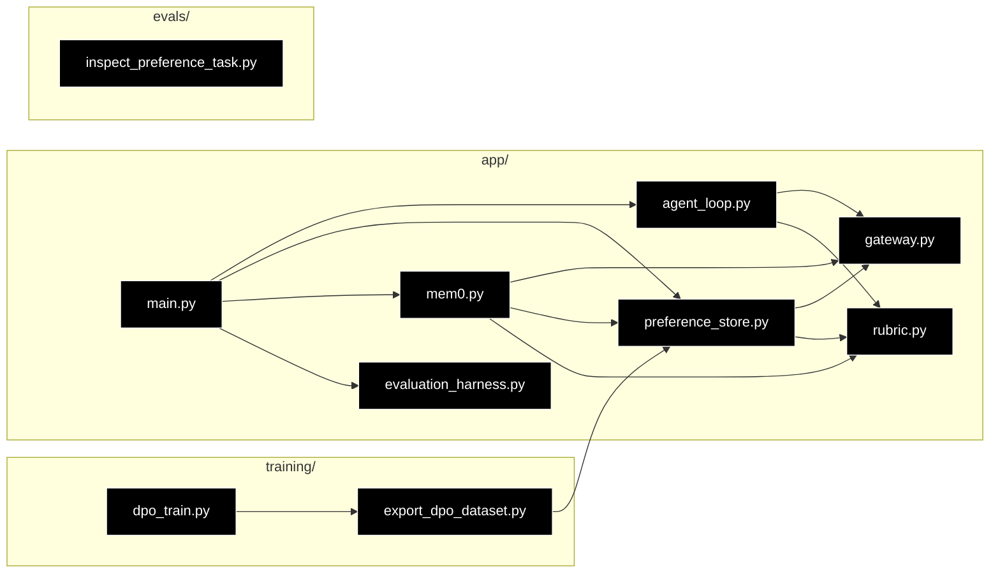

**Internal dependency table** — the `settings` object (`app/config.py`) and
schema types (`app/schemas.py`) are shared across nearly all modules but
omitted from the diagram for clarity:

| Module | Imports from |
|---|---|
| `app/main.py` | `agent_loop`, `gateway`, `rubric`, `preference_store`, `mem0`, `evaluation_harness`, `config`, `prompts`, `schemas` |
| `app/agent_loop.py` | `gateway`, `rubric`, `routing`, `prompts`, `schemas`, `config` |
| `app/gateway.py` | `config`, `schemas`, `logging_config`, `budget` |
| `app/rubric.py` | `config`, `schemas` |
| `app/mem0.py` | `gateway`, `rubric`, `prompts`, `schemas`, `config` |
| `app/preference_store.py` | `db`, `schemas`, `config` |
| `app/evaluation_harness.py` | `preference_store`, `schemas`, `config` |
| `training/export_dpo_dataset.py` | `preference_store` |
| `training/dpo_train.py` | `export_dpo_dataset`, `preference_store` |
| `evals/inspect_preference_task.py` | `schemas` |

---

## 3. Correction Loop — Detailed Sequence

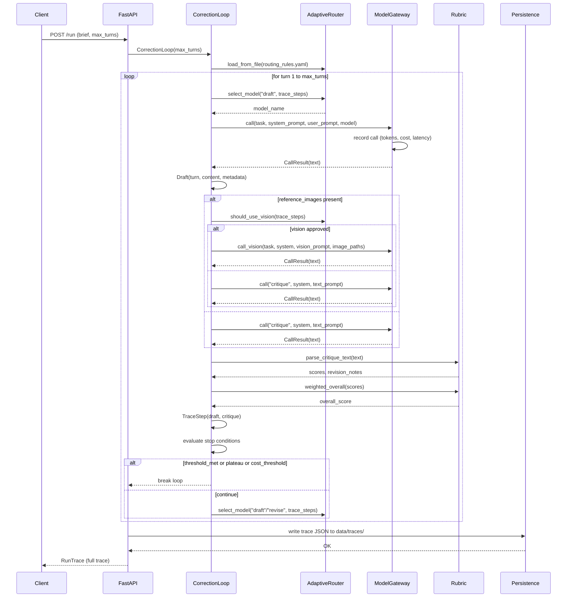

---

## 4. Rubric Weight Update — Bradley-Terry Gradient

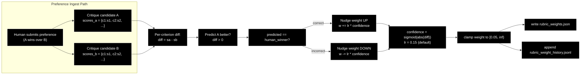

**Mechanics:**
- Each criterion's score difference (`sa - sb`) is compared against the human's
  pick (A wins → `diff > 0` is correct)
- Confidence is scaled via the sigmoid of the absolute difference — larger
  score gaps produce more confident weight updates
- Weights are nudged up (correct prediction) or down (incorrect prediction)
  by `learning_rate × confidence`
- Weights are clamped to a minimum of 0.05 to prevent criteria from being
  fully ignored
- Every update is persisted to both `rubric_weights.json` (current state) and
  `rubric_weight_history.jsonl` (for tracking evolution over time)

---

## 5. Data Flow — End-to-End Pipeline

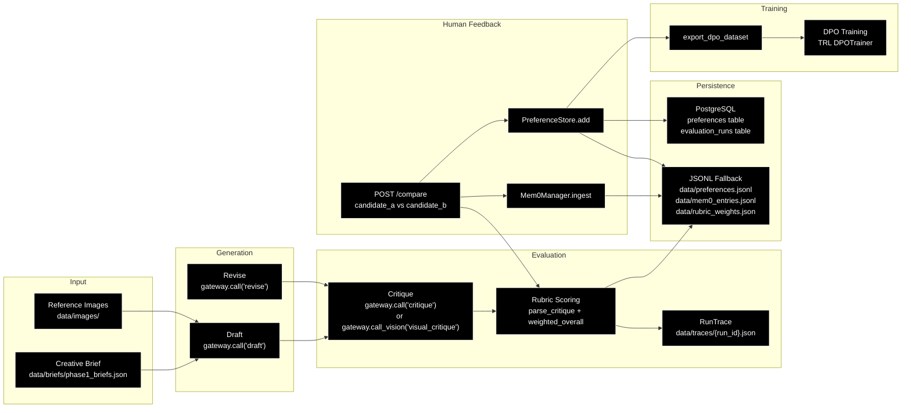

**Pipeline stages:**

1. **Input**: A creative brief and optional reference images are received
2. **Generation**: The draft model produces an initial shot list; revision
   models refine it based on critique feedback
3. **Evaluation**: A critic model scores the draft against rubric criteria;
   vision-grounded critique uses reference images when available
4. **Human Feedback**: Human raters submit pairwise preferences via the
   `/compare` endpoint; Mem0 tracks compression pairs; preferences are persisted
5. **Persistence**: Data is written to PostgreSQL (primary) and JSONL
   (fallback) for durability
6. **Training**: Preference data is exported to DPO format and used for
   fine-tuning with TRL's `DPOTrainer`

---

## 6. Database Schema — Entity Relationship

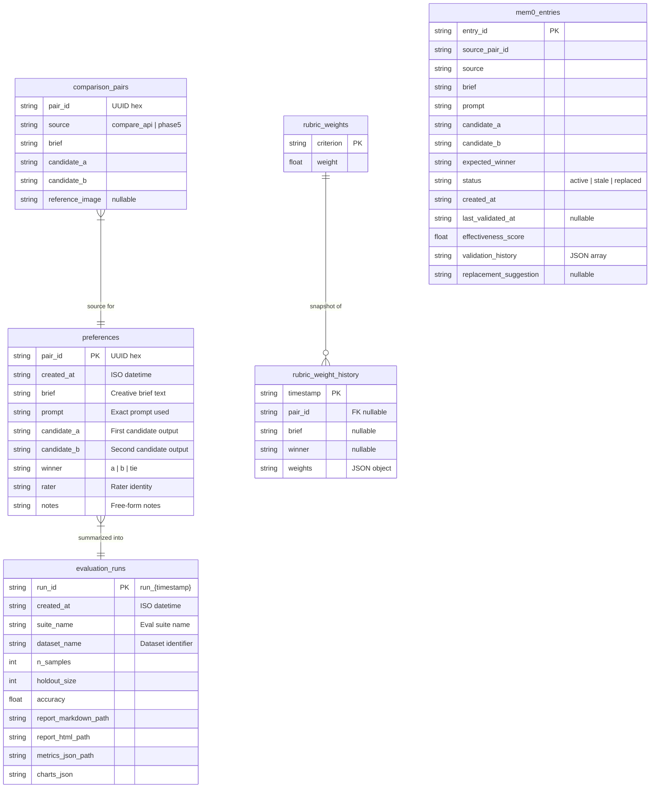

---

## 7. API Endpoint Map

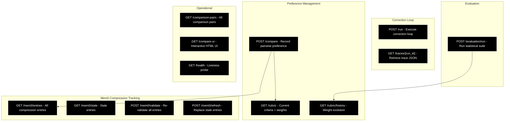

---

## 8. Provider Integration — Gateway Abstraction

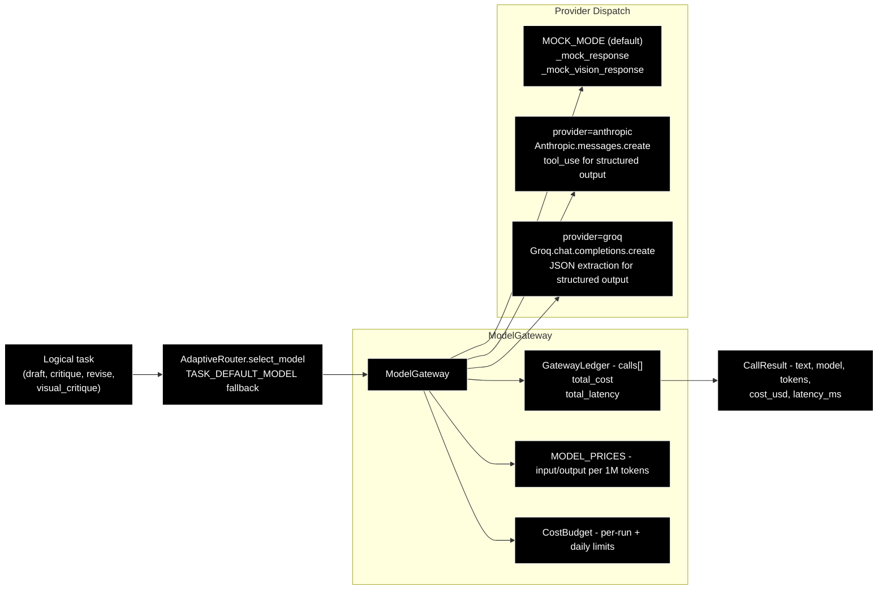

**Provider dispatch logic:**

- `MOCK_MODE` (default): returns synthetic responses for all tasks — no API
  keys or cost
- `provider=anthropic`: uses `AsyncAnthropic.messages.create` with native
  tool use for structured output (critique scores parsed reliably)
- `provider=groq`: uses `Groq.chat.completions.create` with JSON extraction
  for structured output

Every call is recorded by `GatewayLedger` with full provenance (model name,
token counts, cost in USD, latency in ms). `CostBudget` enforces per-run and
daily limits before any call is made.

---

## 9. Evaluation Harness — Statistical Pipeline

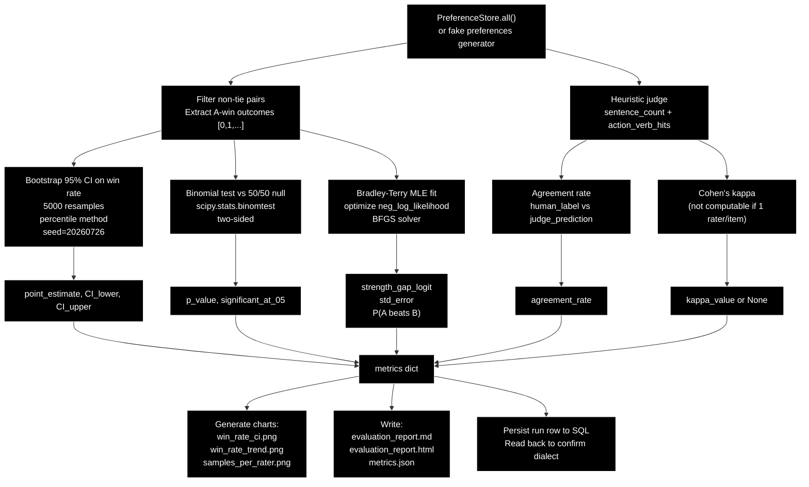

**Statistical methods in the pipeline:**

| Method | Purpose | Implementation |
|---|---|---|
| Bootstrap CI | Confidence interval on human win rate | 5000 resamples, percentile method, fixed seed |
| Binomial test | Significance of win rate vs 50/50 | `scipy.stats.binomtest`, two-sided |
| Bradley-Terry MLE | Relative candidate strength | `scipy.optimize.minimize`, BFGS solver |
| Cohen's κ | Inter-rater agreement | Standard formula, returns `None` if < 2 raters per item |

---

## 10. CI/CD Pipeline — Job Dependencies

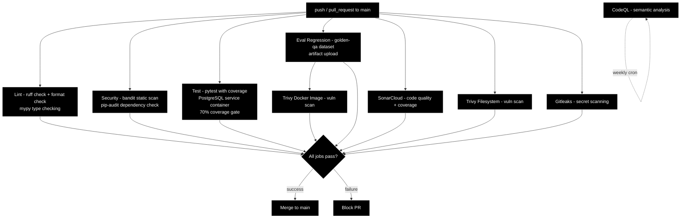

---

## 11. Configuration Binding — Environment to Components

All settings use the `HARNESS_` environment prefix, managed by a single
`Settings` class in `app/config.py` using `pydantic-settings`. A `.env` file
works out of the box for local development.

```mermaid
graph TD
    ENV["HARNESS_ environment variables<br/>.env file"]

    subgraph "Correction Loop"
        LOOP_CFG["max_turns, quality_threshold,<br/>plateau_epsilon,<br/>cost_efficiency_threshold"]
    end

    subgraph "Gateway / Provider"
        GW_CFG["mock_mode, provider,<br/>anthropic_api_key,<br/>groq_api_key"]
    end

    subgraph "Persistence"
        DB_CFG["database_url, database_echo,<br/>preferences_path,<br/>mem0_state_path"]
    end

    subgraph "Storage Paths"
        PATH_CFG["data_dir, traces_dir,<br/>rubric_weights_path,<br/>rubric_weight_history_path,<br/>comparison_pairs_path,<br/>evaluation_reports_dir"]
    end

    subgraph "Budgeting"
        BUDGET_CFG["run_budget_usd, daily_budget_usd"]
    end

    subgraph "Routing"
        ROUTE_CFG["routing_rules_path,<br/>routing_default_models"]
    end

    subgraph "Mem0"
        MEM_CFG["mem0_stale_margin"]
    end

    subgraph "Observability"
        OBS_CFG["langfuse_enabled,<br/>langfuse_public_key,<br/>langfuse_secret_key,<br/>langfuse_host"]
    end

    subgraph "Logging"
        LOG_CFG["log_level"]
    end

    ENV --> LOOP_CFG
    ENV --> GW_CFG
    ENV --> DB_CFG
    ENV --> PATH_CFG
    ENV --> BUDGET_CFG
    ENV --> ROUTE_CFG
    ENV --> MEM_CFG
    ENV --> OBS_CFG
    ENV --> LOG_CFG

    classDef default fill:#000000,stroke:#ffffff,stroke-width:1px,color:#ffffff
```

### Full Configuration Reference

| Variable | Default | Type | Description |
|---|---|---|---|
| `HARNESS_MOCK_MODE` | `true` | bool | Mock responses; `false` for live API calls |
| `HARNESS_PROVIDER` | `anthropic` | str | LLM provider: `anthropic` or `groq` |
| `HARNESS_ANTHROPIC_API_KEY` | None | str | Required when mock mode is off |
| `HARNESS_GROQ_API_KEY` | None | str | Required when provider is `groq` |
| `HARNESS_MAX_TURNS` | `3` | int | Max correction-loop iterations |
| `HARNESS_QUALITY_THRESHOLD` | `8.0` | float | Quality score to stop the loop |
| `HARNESS_PLATEAU_EPSILON` | `0.3` | float | Score delta below which to stop |
| `HARNESS_COST_EFFICIENCY_THRESHOLD` | `0.0` | float | Min quality-per-dollar to continue |
| `HARNESS_DATABASE_URL` | PostgreSQL URL | str | Primary SQL database |
| `HARNESS_DATABASE_ECHO` | `false` | bool | SQL echo for debugging |
| `HARNESS_DATA_DIR` | `data` | str | Base data directory |
| `HARNESS_TRACES_DIR` | `data/traces` | str | Run traces output directory |
| `HARNESS_PREFERENCES_PATH` | `data/preferences.jsonl` | str | JSONL preference fallback |
| `HARNESS_MEM0_STATE_PATH` | `data/mem0_entries.jsonl` | str | Mem0 state file |
| `HARNESS_RUBRIC_WEIGHTS_PATH` | `data/rubric_weights.json` | str | Live rubric weights |
| `HARNESS_RUBRIC_WEIGHT_HISTORY_PATH` | `data/rubric_weight_history.jsonl` | str | Weight history log |
| `HARNESS_COMPARISON_PAIRS_PATH` | `data/comparisons/phase5_pairs.jsonl` | str | Comparison pairs source |
| `HARNESS_EVALUATION_REPORTS_DIR` | `docs/evaluation` | str | Eval output directory |
| `HARNESS_RUN_BUDGET_USD` | None | float | Per-run cost cap |
| `HARNESS_DAILY_BUDGET_USD` | None | float | Daily cost cap |
| `HARNESS_ROUTING_RULES_PATH` | `config/routing_rules.yaml` | str | Routing rules file path |
| `HARNESS_ROUTING_DEFAULT_MODES` | `{}` | dict | Fallback default models per task |
| `HARNESS_MEM0_STALE_MARGIN` | `1.0` | float | Margin below which a pair is stale |
| `HARNESS_LANGFUSE_ENABLED` | `false` | bool | Enable Langfuse tracing |
| `HARNESS_LANGFUSE_HOST` | `http://localhost:3000` | str | Langfuse server URL |
| `HARNESS_LANGFUSE_PUBLIC_KEY` | None | str | Langfuse public key |
| `HARNESS_LANGFUSE_SECRET_KEY` | None | str | Langfuse secret key |
| `HARNESS_LOG_LEVEL` | `INFO` | str | Logging level |

---

## 12. Docker Compose — Service Topology

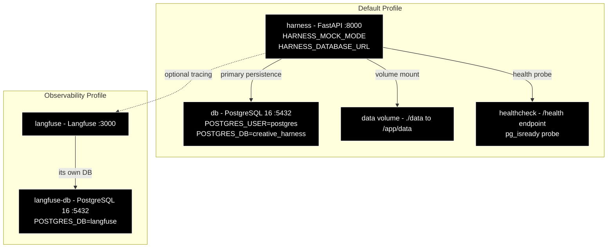

**Service details:**

| Service | Profile | Ports | Notes |
|---|---|---|---|
| `harness` | default | 8000 | FastAPI app; mounts `./data` volume |
| `db` | default | 5432 | PostgreSQL 16; healthcheck via `pg_isready` |
| `langfuse` | observability | 3000 | Langfuse UI; MIT-licensed, self-hosted |
| `langfuse-db` | observability | 5432 | Separate Postgres for Langfuse |

**Usage:**
```bash
docker compose up -d                              # app + PostgreSQL
docker compose --profile observability up -d      # adds Langfuse
```

---

## 13. State Machine — Correction Loop Termination

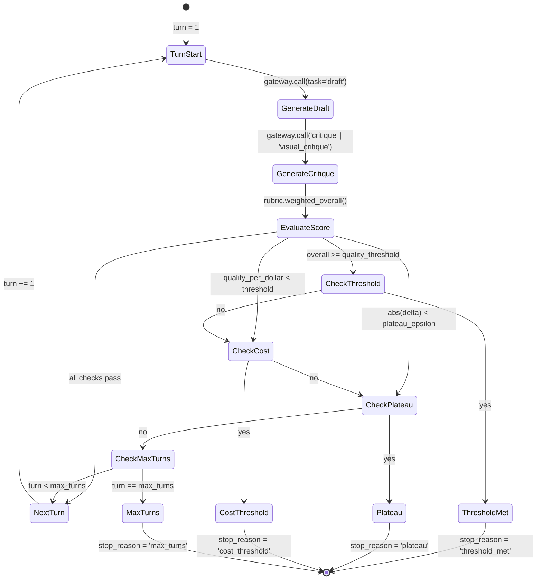

**Stop conditions (evaluated in order after each turn):**

| Condition | Description | `stop_reason` value |
|---|---|---|
| Quality threshold | Overall score ≥ `HARNESS_QUALITY_THRESHOLD` (default 8.0) | `threshold_met` |
| Cost efficiency | Marginal quality-per-dollar < `HARNESS_COST_EFFICIENCY_THRESHOLD` | `cost_threshold` |
| Plateau | Score delta < `HARNESS_PLATEAU_EPSILON` (default 0.3) | `plateau` |
| Max turns | `turn == max_turns` | `max_turns` |

---

## 14. Mem0 Compression Pair Lifecycle

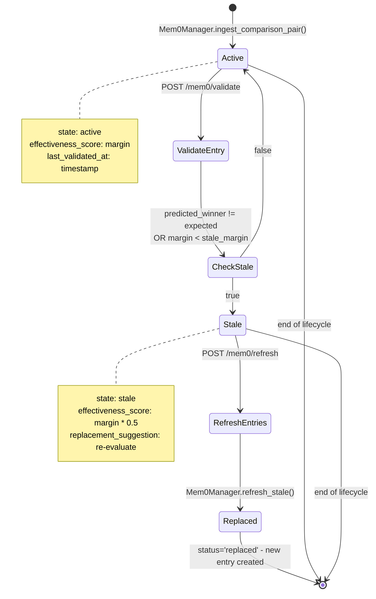

**Lifecycle states:**

| State | Meaning | Trigger |
|---|---|---|
| `active` | Entry is valid; predicted winner matches expectation with sufficient margin | Ingest or validation success |
| `stale` | Entry no longer effective; needs replacement | Validation finds mismatch or small margin |
| `replaced` | Entry has been superseded by a new version | Refresh operation creates replacement |

---

## 15. Prompt Registry — Template Loading

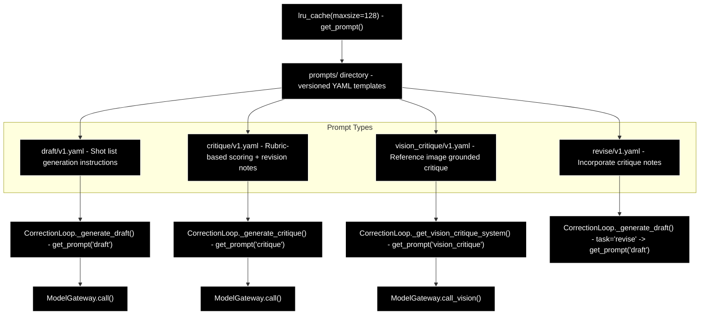

**Prompt types:**

| Task | Template | Criteria | Used In |
|---|---|---|---|
| `draft` | `prompts/draft/v1.yaml` | N/A (generation) | Turn 1: initial shot list |
| `critique` | `prompts/critique/v1.yaml` | clarity, tone_match, actionability | Text-only critique |
| `vision_critique` | `prompts/vision_critique/v1.yaml` | visual_continuity, lighting_match, mood_match | Vision-grounded critique |
| `revise` | `prompts/revise/v1.yaml` | N/A (generation) | Turn 2+: improved shot list |

Templates are loaded from YAML files and cached via `lru_cache(maxsize=128)`
in `app/prompts.py`. Versioning allows A/B testing different prompt
formulations without code changes.

---

## 16. Test Suite — Coverage Distribution

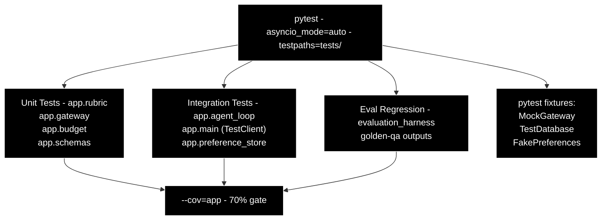

### Test Coverage Distribution

| Test Area | Coverage Share |
|---|---|
| agent_loop correction logic | 25% |
| gateway mock + live paths | 15% |
| rubric scoring + weight updates | 15% |
| preference_store postgres + jsonl | 12% |
| mem0 ingestion + validation | 10% |
| evaluation_harness statistics | 8% |
| routing yaml rules | 5% |
| schema validation | 5% |
| budget enforcement | 5% |

### Test Files

| File | Description |
|---|---|
| `test_agent_loop.py` | Correction loop integration tests |
| `test_agent_loop_coverage.py` | Edge case and coverage tests for the loop |
| `test_budget.py` | Cost budget enforcement and overflow |
| `test_dpo_train.py` | DPO training dry-run validation |
| `test_evaluation_harness.py` | Statistical evaluation pipeline |
| `test_fake_preferences.py` | Demo dataset generation |
| `test_gateway.py` | Gateway mock + live provider paths |
| `test_inspect_eval_task.py` | Inspect AI adapter |
| `test_main.py` | FastAPI endpoint tests (TestClient) |
| `test_mem0.py` | Mem0 store + manager |
| `test_mem0_store.py` | Mem0 entry persistence |
| `test_modern_evaluation_harness.py` | Modern eval harness |
| `test_preference_store.py` | PostgreSQL + JSONL preference storage |
| `test_prompts.py` | Prompt registry |
| `test_routing.py` | Adaptive router YAML rules |
| `test_rubric.py` | Rubric scoring + weight updates |
| `test_training_export.py` | DPO dataset export |
| `test_vision_critique.py` | Vision-grounded critique path |
| `test_phase1.py` | Phase 1 structured output validation |
| `test_phase3.py` | Phase 3 correction loop tests |
| `test_phase4.py` | Phase 4 vision effectiveness tests |
| `test_phase6.py` | Phase 6 rubric calibration tests |

---

## Appendix: Glossary

| Term | Definition |
|---|---|
| **Brief** | A creative scene description given to the shot-list generator |
| **Shot list** | A numbered sequence of camera shots for a scene |
| **Critique** | A model's evaluation of a shot list against the rubric |
| **Correction loop** | The iterative cycle of draft → critique → revise |
| **Rubric** | The scoring framework with weighted criteria |
| **Preference pair** | A human judgment: candidate A vs candidate B, which is better |
| **Mem0** | Compression pair tracking — re-validates comparison pairs over time |
| **DPO** | Direct Preference Optimization — turning preferences into fine-tuning data |
| **VLM** | Vision-Language Model — a model that processes both text and images |
| **Escalation** | Upgrading to a more capable (but costly) model when the cheap one fails |
| **Mock mode** | Synthetic responses without real API calls — for testing |
| **Gateway ledger** | Per-run record of all model calls, costs, and latencies |
